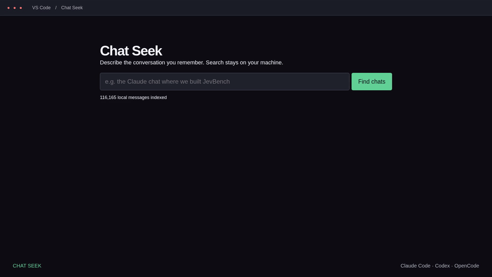

**Point your coding agent at this repository and ask it to install Chat Seek in your local VS Code—see [Agent installation instructions](#agent-installation-instructions) below.**

# Chat Seek

Find past **Claude Code, Codex, and OpenCode** conversations from a plain language description, inside VS Code.



[Demo video](media/demo.mp4) · [Narrated explainer](media/explainer.mp4). These videos show the original UI with illustrative excerpts; the current version also has dates, summaries, and resume actions.

Chat Seek searches local user and assistant messages, then uses the [Laya local decision model](https://github.com/receptron/laya) to rerank likely matches. Optional one-sentence AI descriptions help you recognize a chat. Cards show its last activity (“1 week ago”), with the exact date on hover, a readable excerpt, and a **Resume in Claude Code / Codex / OpenCode** action.

## Open and pin Chat Seek

Press **Ctrl+Shift+P** (**Cmd+Shift+P** on macOS), run **Chat Seek: Search past AI chats**, and type in the search box. You can also click the **Chat Seek magnifying-glass icon in the Activity Bar** to use the sidebar.

Click **Pin search tab** to keep the editor tab handy. You can right-click the Activity Bar to show Chat Seek if its icon is hidden, or drag its view to your preferred sidebar. If commands do not appear immediately after installation, run **Developer: Reload Window**.

**Resume** opens the matching CLI in a VS Code integrated terminal using its session ID and original working directory when available. It does not automatically submit a new prompt. The CLI must be installed and signed in within the same environment as the extension. This launches the CLI, not a vendor's proprietary chat sidebar. An archived or moved session may no longer be resumable by its CLI; **Read excerpt** still opens the indexed context.

## Optional summaries and API keys

Search, indexing, and Laya reranking work without an API key. Summaries are **off by default**. Click **Configure summaries** in Chat Seek, or run **Chat Seek: Configure summaries**. Add an API key through the masked input (stored in VS Code SecretStorage), then enable summaries after reviewing the provider disclosure. Existing environment keys are also supported; merely having a key does not enable uploads.

In `auto` mode, Chat Seek tries only providers with a key and model configured, in this order. Missing keys are skipped; request errors fall through to the next configured provider. Choose one provider in settings to prevent cross-provider fallback.

| Provider | Environment variables | Default model |
| --- | --- | --- |
| OpenAI | `OPENAI_API_KEY` | `gpt-4.1-nano` |
| OpenRouter | `OPENROUTER_API_KEY` or `OPEN_ROUTER_API_KEY` | `openai/gpt-4.1-nano` |
| TensorX | `TENSORX_API_KEY` | `z-ai/glm-5.3-flash` |
| Custom OpenAI-compatible endpoint | `CHAT_SEEK_API_KEY` | Set your model and base URL |

SecretStorage keys take precedence over environment keys for the same provider. Removing a stored key does not remove an environment key. VS Code must inherit environment variables; reload/restart the relevant local or remote extension host if new variables are not visible. Never put keys in committed settings, prompts, screenshots, or this repository.

Override models under `chatSeek.summaries.<provider>Model`. For example, use `gpt-5.6-luna` or `openai/gpt-5.6-luna` when available to your provider account; GPT-5/6 overrides request low reasoning. The default nano model is inexpensive and avoids a reasoning step for this small task. Model availability and prices can change—check your provider.

For other providers or a local server, set `chatSeek.summaries.provider` to `custom`, `chatSeek.summaries.customUrl` to the OpenAI-compatible base URL (for example `https://your-provider.example/v1`), and `chatSeek.summaries.customModel` to its exact model ID. HTTPS is required except for localhost. Add the custom key via Configure summaries or `CHAT_SEEK_API_KEY`.

Descriptions are generated lazily for displayed search results (up to 30 chats, two requests at a time), not for the entire archive on installation. Each request includes at most 12 sampled messages of up to 600 characters apiece, distributed across the chat. Summaries are cached locally by chat content, reused across queries, and regenerated when indexed messages change. Long chats can span many topics: a sampled summary is a recognition aid, and the matching excerpt remains available. API failures leave ordinary search results usable.

**Privacy:** enabled summaries send sampled excerpts to the configured provider(s) and may incur API charges. Common credential patterns and known environment secrets are redacted, but redaction cannot remove every kind of sensitive information. Other private chat text can still be sent. The UI labels AI summaries and their provider. Disable summaries to keep search entirely local. Private indexes and summary caches live in VS Code extension storage; do not publish them.

## Install manually

Download the Linux x64 VSIX from the [latest release](https://github.com/fstandhartinger/chat-seek-vscode/releases/latest). In VS Code, run **Extensions: Install from VSIX...**, select it, and open Chat Seek. The prebuilt package supports Linux x64, including VS Code Remote WSL. VS Code 1.99+ is required.

To build on Linux x64 with Node.js 20+:

```sh
npm ci
npm test
npm run lint
npm run package
code --install-extension chat-seek-linux-x64-0.2.0.vsix --force
```

Use `code-insiders` for VS Code Insiders. In a remote window, install into the environment containing the histories, not just the local UI host. Building for another platform requires changing the `vsce --target` argument and `.vscodeignore` ONNX native-binary exclusions to retain that platform's runtime. The supplied VSIX must not be relabeled for another platform.

The first Laya use downloads about 1.7 GB of model weights into `~/.cache/receptron-laya`. The runtime uses CPU inference. Keyword results appear first; Laya then refines the order. Set `chatSeek.useLaya` to `false` if the machine cannot support the model. Opening the search refreshes the local index; unchanged transcript files are reused. **Refresh chats** updates it while the panel is open.

## Agent installation instructions

When a user points you at this repo to install Chat Seek:

1. **Identify the actual VS Code environment.** Check standard VS Code versus Insiders, OS and CPU architecture, WSL/SSH/container use, the active user's home, and which environment holds their chat files. Find the correct `code`/`code-insiders` CLI. Do not assume a Windows UI means the extension should run on Windows when the chats are in WSL.
2. **Install the matching release or build it locally.** Clone this public repository. On Linux x64, install the latest release VSIX, or use the build commands above. For another platform, adjust the packaging target and native runtime exclusions, build on that platform, and verify the included ONNX runtime. Keep local adjustments documented; never bundle private histories or credentials.
3. **Locate histories and adjust only what is needed.** Defaults are below. Use `chatSeek.extraRoots` for custom roots or Windows mounts. Verify a known chat can be indexed; use local indexing and synthetic text for API smoke tests. No API key is required for basic installation.
4. **Explain optional summaries.** Tell the user they can now provide an OpenAI, OpenRouter, TensorX, or compatible-provider key through **Chat Seek: Configure summaries**. Explain sampled-excerpt uploads, possible charges, local caching, and the configured fallback order. Never ask them to paste a key into a public issue or commit it. Leave summaries disabled unless they authorize enabling them; if they already authorized it, carry that authorization forward. Prefer SecretStorage or existing environment variables.
5. **Verify the installed result.** Check `code --list-extensions --show-versions` (or the appropriate Insiders/remote CLI) for `fstandhartinger.chat-seek`. Verify commands and the sidebar are available. If a native runtime cannot load, report that accurately and keep keyword search usable.
6. **Give concrete opening instructions.** Tell the user: “Press Ctrl+Shift+P (Cmd+Shift+P on macOS), run Chat Seek: Search past AI chats, and type your description. You can also use the Chat Seek Activity Bar icon. Click Pin search tab to keep it handy.” Suggest **Developer: Reload Window** only if the command/icon has not appeared. Explain that Resume opens the corresponding CLI in VS Code's terminal and may require CLI login.

Finish by stating which environment/version you installed, where to open the search, whether summaries are enabled, which provider/model is configured, and any actual local limitations. Do not claim to have tested interactive CLI resumption if you only verified its arguments.

## Supported history and limitations

- `~/.claude/projects` and `~/.claude/archived_projects`
- `~/.codex/sessions` and `~/.codex/archived_sessions`
- `~/.local/share/opencode/storage` (file-based session/message/part storage)

`chatSeek.extraRoots` accepts additional paths. Paths containing `codex` or `opencode` select those parsers; other paths are treated as Claude Code roots. OpenCode roots should point at its `storage` directory. Only user and assistant text is indexed; tool results and subagent transcripts are excluded. Newer OpenCode database-only storage is not yet imported.

The shortlist depends on word overlap; a description with no shared words can miss a chat. Long messages are clipped at 2,800 characters, and previews show nearby indexed messages. Missing timestamps are labeled “Date unknown”. Dates refer to the latest indexed message in the conversation. Native resume availability depends on the source application's retained session files.

## Development

Run `npm test`, `npm run lint`, and `npm run package`. Tests cover parser behavior, index updates, summary cache invalidation and fallback, redaction, relative dates, and safe resume arguments. Public videos use illustrative data.

MIT license. Laya weights are downloaded separately under Apache 2.0.
